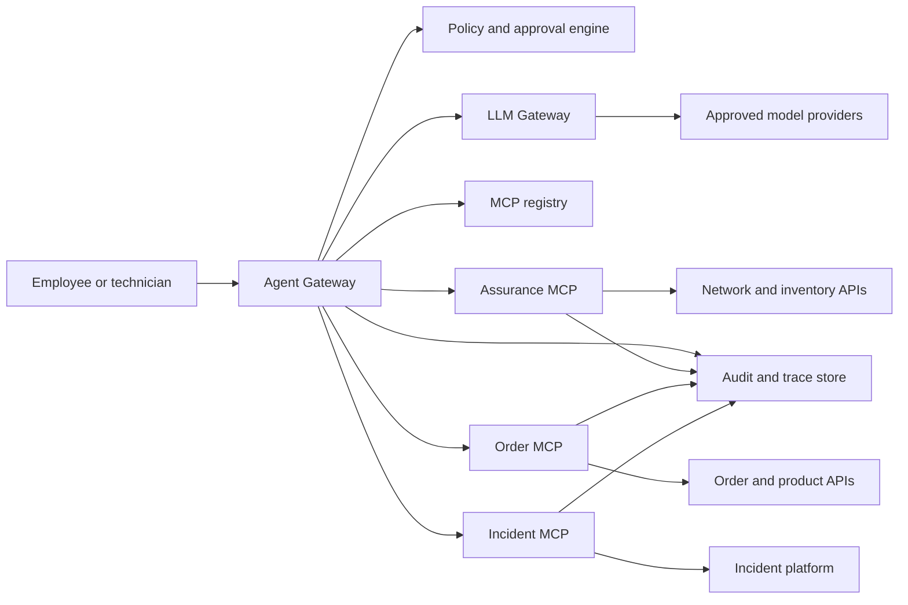

MCP is useful.

It is also not the strategy.

That distinction matters, because a lot of companies are about to make the same mistake with AI agents that they already made with APIs, microservices, RPA, event streaming, and low-code platforms.

They will see a protocol, mistake it for an operating model, and then wonder why every team has a different agent stack, a different auth pattern, a different audit trail, a different way of calling tools, and a different answer to the question: "Who was allowed to do what, on behalf of whom, and why?"

Model Context Protocol is a good way to expose tools and context to agents.

But in an enterprise, the winning move is not "build some MCP servers."

The winning move is to build the control plane around them.

That means an Agent Gateway, an LLM Gateway, a governed MCP platform, and a security model that treats agent actions as real production actions, not clever autocomplete.

## The real product is not the chatbot

The tempting story is simple:

A technician asks an AI assistant what is wrong with a customer service. The assistant checks network health, modem status, orders, incidents, and inventory. It explains the likely fault and proposes the next action.

That is a good demo.

But the demo is not the architecture.

The real product is the platform underneath the assistant:

- how the technician is authenticated
- how the agent is allowed to act on that technician's behalf
- how tools are discovered, approved, versioned, and retired
- how customer data is classified before it reaches a model
- how a tool call is logged, replayed, blocked, or challenged
- how the company avoids ten teams building ten incompatible agent gateways

If those questions are not answered centrally, the company does not get an AI platform.

It gets shadow integration with a friendlier UI.

## Three layers, three jobs

The cleanest pattern is to separate three concerns that often get mashed together.

### 1. LLM Gateway

The LLM Gateway owns model access.

It should decide which model can be used for which class of data, use case, cost profile, latency target, and regulatory boundary.

It should handle:

- provider routing
- model allowlists
- token and cost controls
- data retention policies
- prompt and response logging rules
- redaction and sensitive data filtering
- evaluation hooks
- fallback behavior

The LLM Gateway should not know the deep business meaning of "diagnose this customer line" or "create this incident."

Its job is to make model usage governable.

### 2. Agent Gateway

The Agent Gateway owns orchestration.

It receives the user request, resolves identity and context, chooses the right agent flow, controls tool access, enforces approvals, and records the decision trail.

It should handle:

- user and session context
- agent routing
- tool policy enforcement
- consent and step-up approval
- prompt-injection containment
- conversation state
- audit correlation
- human handoff

This is where the company decides whether an AI interaction is read-only, advisory, operational, or allowed to trigger a write action.

That distinction is not cosmetic. It is the difference between an assistant that can explain a fault and an assistant that can create an incident in production systems.

### 3. MCP servers

MCP servers expose domain tools.

They should not be random wrappers around internal APIs. They should be product-grade domain interfaces owned by the teams that understand the systems behind them.

Good MCP servers expose capabilities like:

- `get_customer_health`
- `diagnose_service`
- `get_modem_status`
- `explain_network_fault`
- `create_incident`
- `get_order_status`

Bad MCP servers expose a pile of raw backend operations and hope the agent figures it out.

That is not intelligence.

That is outsourcing architecture to a language model.

## MCP should be domain-owned, not platform-owned

The central AI platform team should not own every MCP server.

That would create a bottleneck, and worse, it would separate tool ownership from domain knowledge.

The better model is federated ownership with central standards.

The platform team owns:

- MCP server standards
- gateway integration patterns
- auth and policy requirements
- schema quality gates
- observability requirements
- reference implementations
- developer tooling
- certification

Domain teams own:

- the tools in their domain
- the mapping to backend APIs
- business rules
- data semantics
- lifecycle and versioning
- operational support

That is the same lesson enterprise architecture keeps relearning: centralize the platform, federate the products.

## Security starts with identity, not prompts

The wrong way to secure agents is to start with prompt rules.

Prompt rules matter, but they are not the security foundation.

The foundation is identity, authorization, policy, and audit.

For enterprise MCP, the baseline should look like this:

- the user authenticates through the enterprise identity provider
- the Agent Gateway receives a user-bound session
- tool calls run with explicit scopes
- MCP servers validate audience-bound access tokens
- write actions require separate scopes and sometimes step-up approval
- workload-to-workload calls use mTLS or workload identity
- every agent run has a correlation ID across gateway, MCP, API, and downstream system logs

MCP's own authorization direction treats protected MCP servers as OAuth resource servers that validate access tokens intended for them. That is the right mental model for enterprises: MCP servers should not become little identity providers scattered across the company.

They should enforce tokens, scopes, and policy.

They should not invent security.

## The agent must never be "the user"

This is a subtle but important point.

The agent should act on behalf of a user, but it should not become a vague super-user.

Every tool call needs a clear answer to four questions:

- who is the human?
- which agent or workflow is acting?
- which tool is being called?
- what permission allowed this exact action?

That is how you avoid the worst version of enterprise AI: a helpful assistant with broad backend access and a fuzzy audit trail.

For low-risk read operations, the gateway can authorize directly from the user's role and tool scope.

For high-risk operations, the gateway should require policy checks:

- is this action allowed for this user?
- is the customer context valid?
- is there a current ticket, order, or service relationship?
- does the action require confirmation?
- does the tool need a human-readable preview before execution?

Agents should not get broad trust because they are useful.

They should get narrow authority because the platform can prove the action is allowed.

## Prompt injection is a tool-safety problem

Prompt injection is usually described like a model problem.

In enterprise systems, it is more useful to treat it as a tool-safety problem.

The model will read messy input: customer notes, emails, order comments, incident descriptions, scraped diagnostics, vendor data, and maybe malicious text embedded somewhere inside that context.

Some of that input may try to instruct the model to ignore policy, reveal data, or call a tool it should not call.

You cannot solve that by adding one heroic system prompt.

You solve it by designing the runtime so a confused model cannot cause too much damage.

That means:

- tools have narrow schemas
- tools validate input server-side
- tools return structured outputs
- write tools require confirmation
- high-risk tools require policy decisions outside the model
- external content is marked as untrusted
- agent plans are logged before execution
- the gateway can deny tool calls even if the model asks for them

The LLM can recommend.

The gateway decides.

The tool enforces.

That separation is the architecture.

## Build MCPs like APIs, not scripts

The best way to build MCP servers is boring in the right way.

Treat them like APIs with stronger product semantics.

Each MCP server should have:

- a domain owner
- a clear purpose
- typed tool schemas
- input validation
- output contracts
- versioning rules
- auth scopes
- rate limits
- audit events
- error taxonomy
- test fixtures
- operational dashboards
- deprecation policy

The mistake is to expose backend APIs directly and call that an MCP layer.

An MCP tool should be closer to a business capability than a database operation.

For example, a technician should not need an agent that separately calls inventory, VLAN, IP address, technology, order, modem, and incident APIs, then guesses the service health story from raw fragments.

The agent should call a domain tool such as `get_customer_health`, and that tool should return a structured, explainable view:

```json
{
  "customerId": "redacted",
  "serviceId": "redacted",
  "status": "degraded",
  "confidence": "high",
  "signals": [
    {
      "source": "access_network",
      "status": "warning",
      "summary": "Optical signal is outside normal operating range"
    },
    {
      "source": "order",
      "status": "ok",
      "summary": "No active migration or open fulfillment order"
    }
  ],
  "recommendedNextAction": "run_line_diagnostics"
}
```

That is a better interface for agents because it encodes domain meaning.

It is also a better interface for humans.

## Start with a thin slice

The platform should not begin with a giant enterprise rollout.

It should begin with one narrow, valuable, production-shaped slice.

A good first slice is technician support:

1. technician asks a question about a customer service
2. Agent Gateway authenticates the technician and resolves context
3. the agent calls read-only diagnostic MCP tools
4. the LLM summarizes the result in technician language
5. the agent proposes a next action
6. creating an incident requires confirmation and write scope
7. the full run is logged end-to-end

That slice is small enough to ship.

It is also rich enough to prove the platform:

- identity
- tool authorization
- MCP contracts
- model routing
- audit
- data minimization
- human approval
- operational monitoring

If the slice cannot prove those things, the platform is not ready for broader adoption.

## The reference architecture

The shape I would aim for looks like this:



The important part is not the boxes.

The important part is where the decisions live.

Model routing lives in the LLM Gateway.

Tool authorization lives in the Agent Gateway and policy engine.

Domain logic lives in MCP servers.

System-specific complexity stays behind the domain boundary.

Audit crosses everything.

## What the platform team should deliver

If a team wants to win the mandate for MCP, Agent Gateway, and LLM Gateway across a large company, it should not pitch a loose collection of agents.

It should pitch a platform capability.

The first deliverables should be:

- a reference Agent Gateway
- a reference LLM Gateway policy model
- a remote MCP server template
- a tool contract standard
- an MCP registry
- a security and auth blueprint
- a prompt-injection and tool-safety pattern
- an observability standard
- a certification process for domain MCPs
- one production pilot with measurable outcomes

The story should be simple:

> We will let domain teams build AI tools quickly, but inside one governed runtime where identity, security, policy, audit, and model usage are handled once.

That is a much stronger bid than "we can build a chatbot."

## What to measure

The platform should be measured like an enterprise integration product, not like a demo.

Useful measures include:

- time to onboard a new MCP server
- percentage of tool calls with complete audit context
- number of reusable domain tools
- reduction in technician lookup time
- first-contact resolution impact
- number of blocked unsafe tool calls
- model cost per resolved workflow
- incident quality and completeness
- policy exceptions by domain
- gateway availability and latency

The company should also measure developer experience.

If domain teams cannot build and certify MCP servers without begging the central team for every change, adoption will fail.

Governance that kills speed is just another bottleneck.

The goal is governed speed.

## The real argument

MCP is exciting because it gives agents a common way to use tools.

But the enterprise value is not the protocol by itself.

The enterprise value is the control plane around the protocol:

- one way to authenticate
- one way to authorize
- one way to audit
- one way to route models
- one way to certify tools
- one way to let teams move fast without creating a security mess

That is the architecture worth building.

Not an AI assistant sitting on top of fragile integrations.

An enterprise agent platform where MCP servers become governed domain products, the Agent Gateway becomes the runtime control point, and the LLM Gateway makes model usage manageable instead of accidental.

That is how MCP becomes more than a clever connector pattern.

That is how it becomes enterprise infrastructure.

## References

- [Model Context Protocol authorization specification](https://modelcontextprotocol.io/specification/2025-11-25/basic/authorization)
- [OWASP Top 10 for Large Language Model Applications](https://owasp.org/www-project-top-10-for-large-language-model-applications/)
- [OpenAI MCP and connectors guidance](https://developers.openai.com/api/docs/guides/tools-connectors-mcp)
