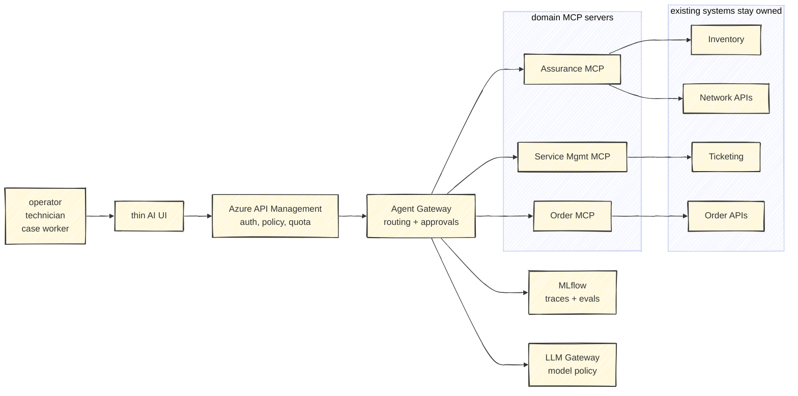
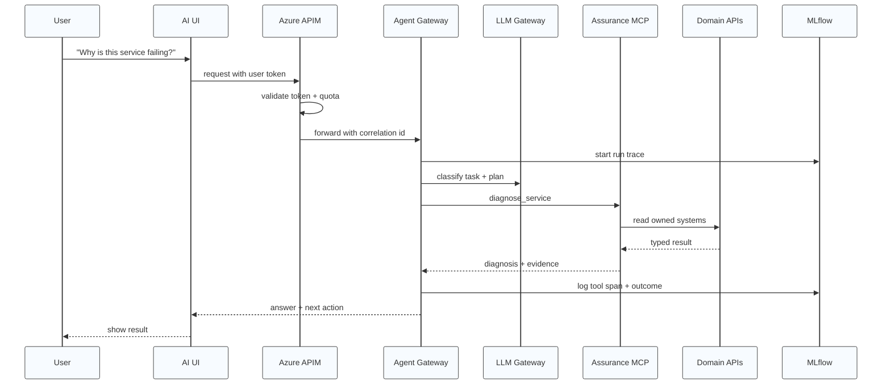
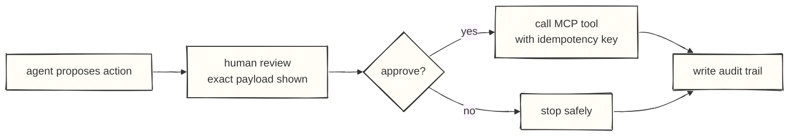

AI can generate code now.

That is useful.

It is also not the bottleneck.

Most companies are not slow because they lack code. They are slow because every useful change has to cross ownership boundaries, security reviews, integration queues, unclear APIs, approval paths, environment constraints, audit requirements, and systems nobody wants to touch casually.

If AI just helps every team generate more code into that mess, the company does not become faster.

It gets more mess.

The point of an MCP platform is not to produce more wrappers, more agents, or more clever tool calls. The point is to remove the bottlenecks that stop useful automation from becoming safe production capability.

That changes the architecture.

It starts innocently enough. A team needs an assistant. They wrap a few APIs as tools, add a model, ship a demo, and call it a platform. Another team does the same thing two weeks later. Then another. Six months later the company has five agent stacks, six logging patterns, three ways to approve tool calls, no shared policy model, and a growing fear that somebody gave a model more authority than anyone meant to.

That is not a tooling problem.

It is an architecture problem.

If the need is real but the budget is limited, the answer is not to build less carefully. It is to build fewer things, with much cleaner boundaries.

For MCP, the winning move is simple:

Build one small Agent Gateway. Put Azure API Management in front of it. Use domain-owned MCP servers behind it. Use MLflow for traces, evaluation, and feedback. Use the platform to make the path from business need to governed tool call shorter.

That is the platform.

Not a giant AI program. Not an internal chatbot carnival. Not an excuse to generate more code than anyone can own.

A small, boring, governable execution path for agents that need to touch real systems.

## More code does not remove the bottleneck

This is the trap in a lot of enterprise AI thinking:

"If agents can write code, delivery will become cheap."

Some delivery will become cheaper. Scaffolding, tests, adapters, examples, documentation, migration scripts, and repetitive glue code will all get faster.

But the hard parts of enterprise delivery are rarely just typing code.

The hard parts are:

- Which domain owns the capability?
- Which API is the source of truth?
- Which user is the agent acting for?
- Which data is allowed to leave the system?
- Which action needs human approval?
- Who reviews a failed tool call?
- What happens when downstream systems disagree?
- How does security replay what happened?
- How does the second team reuse the pattern without copying the first team's shortcuts?

More generated code can actually make those bottlenecks worse. Every team can generate its own connector, its own policy, its own logging, and its own version of "temporary" integration. That looks like acceleration from inside a sprint. From the enterprise view, it is just faster fragmentation.

The useful goal is not code generation.

The useful goal is bottleneck removal.

That is why the architecture needs APIM, an Agent Gateway, domain-owned MCPs, and MLflow-style trace/eval loops. Not because those boxes are fashionable. Because they remove different bottlenecks:

- APIM removes the "how do we expose and govern this safely?" bottleneck.
- The Agent Gateway removes the "who can use which agent/tool/action?" bottleneck.
- Domain MCP servers remove the "who owns this integration surface?" bottleneck.
- MLflow removes the "how do we learn from real runs without guessing?" bottleneck.
- Tool contracts remove the "what exactly does this tool do and what can go wrong?" bottleneck.

## The shape I would build first

I would not start by asking which agent framework should win.

I would start with the bottleneck map.

Where does the work get stuck today?

- waiting for another team to expose an API
- waiting for security to approve a new integration path
- waiting for someone to clarify who owns a business rule
- waiting for manual checks across five systems
- waiting for someone to turn a diagnosis into an incident
- waiting for an audit answer after something went wrong

Those are the constraints the platform should remove.

And the first bottleneck to remove is usually ownership.

The first useful question is: which domain owns the action?

If the tool diagnoses a customer service, that belongs to the assurance domain. If it checks an order, that belongs to the order domain. If it opens a ticket, that belongs to the service-management domain. The MCP server should follow that ownership line.

That sounds obvious, but it is where many agent architectures go wrong. They build one big "AI tools service" owned by the AI/platform team. It wraps everything. It knows too much. It grows too quickly. After a while, nobody knows whether business rules live in the original system, the MCP wrapper, the prompt, or the agent's workflow code.

That is exactly the mess domain-driven design was invented to avoid.

An MCP server should be a domain capability surface, not a bag of endpoints.



This is deliberately not fancy.

The expensive parts of agent platforms are not the boxes. They are the consequences of putting the wrong responsibilities in the wrong boxes.

## Azure API Management belongs at the front

If the company already has Azure API Management, use it.

Do not rebuild the front door in the Agent Gateway.

APIM is good at the things that should be boring:

- validating JWTs or Microsoft Entra tokens before traffic reaches the backend
- applying rate limits and quotas
- enforcing subscription/product access
- attaching policy to API or MCP surfaces
- emitting monitoring data through the Azure stack
- giving teams a known API governance pattern

Microsoft is also clearly moving APIM toward MCP governance. The current docs describe exposing REST APIs as MCP servers, selecting which operations become tools, associating those MCP servers with APIM products, and applying APIM policies to the resulting tools.

That matters.

It means MCP does not have to live outside the API governance model. Existing REST APIs can be exposed as tools. MCP endpoints can sit behind familiar policy gates. Enterprise discovery can happen through the same platform muscle the organization already knows.

The bottleneck lesson is: spend less custom effort on gateway plumbing.

Spend more effort on tool contracts.

## The Agent Gateway should stay thin

The Agent Gateway is not the place to hide every integration shortcut.

Its job is to decide:

- who is asking
- what task they are trying to perform
- which agent flow is allowed
- which MCP tools are available
- whether the action needs human approval
- which model route is permitted
- what gets written to trace and audit

Its job is not to know the deep business rules for every domain.

If a technician asks, "Why is this service down?", the Agent Gateway may route the request to an assurance workflow. But the `diagnose_service` tool should live in Assurance MCP, owned by the team that understands the network, customer state, fallbacks, and failure modes.

If the same technician asks to create an incident, the Agent Gateway should recognize that this is a higher-risk action and insert an approval step. The actual incident creation should still sit behind a domain-owned tool with an idempotency key and a proper audit trail.

That split is what keeps the system cheap to grow.

It also keeps the bottleneck visible. If a tool is slow to create because the domain cannot agree what the action means, the answer is not to let the agent improvise. The answer is to expose the disagreement and resolve the domain boundary.

## MLflow is useful, but not as magic glue

MLflow is the part I would use carefully.

It is tempting to say: "Build the Agent Gateway in MLflow." I would not start there.

MLflow is strongest as the evidence layer around the platform:

- traces of agent runs
- tool-call spans
- prompt and model versions
- feedback and human assessments
- evaluation datasets
- regression checks before changing tools
- latency and cost comparisons

The official MLflow MCP server is aimed at interacting with MLflow traces programmatically. The docs also mark that MCP feature as experimental. That is useful, but it is not the same thing as a complete enterprise Agent Gateway.

So the better budget architecture is:

- APIM as the enterprise front door
- a small custom Agent Gateway for runtime policy and orchestration
- MLflow for tracing, evaluation, and improvement loops
- domain MCP servers for owned capabilities

This gives you a learning system without pretending the observability tool is the whole runtime.

## The first version should be almost embarrassingly small

The right first release has one domain and three tools.

Pick a painful workflow. Technician support is a good candidate because the value is obvious: fewer manual lookups, faster diagnosis, better incident quality.

Start with:

- one read-only tool
- one diagnostic tool
- one write/action tool that requires confirmation

Example:

```yaml
domain: Assurance
mcp: assurance-mcp
tools:
  - name: get_customer_service_summary
    risk: low
    scope: assurance:read
  - name: diagnose_service
    risk: medium
    scope: assurance:diagnose
  - name: create_incident
    risk: high
    scope: assurance:incident:create
    requiresApproval: true
```

That is enough to prove the model.

If those three tools cannot be built with clean ownership, policy, trace, and approval, adding twenty more tools will not fix it. It will just make the confusion harder to see.

## A practical request flow



For a high-risk action, add a stop:



This is the boring control that makes agent actions acceptable in production. The model can suggest. Deterministic code decides whether the action is allowed.

## What the MCP contract should contain

Every tool needs a contract that is readable by both humans and machines.

Not just a JSON schema. A real operating contract.

```yaml
tool: diagnose_service
owner: Assurance
risk: medium
scope: assurance:diagnose
dataClass: customer-operational
input:
  customerId: string
  serviceId: string
  symptom: string
output:
  status: healthy | degraded | down | unknown
  likelyCause: string
  evidence:
    - source: string
      value: string
  recommendedAction: string
controls:
  approval: false
  idempotencyKey: optional
  modelDataRule: minimize_before_model
  auditPayload: metadata_plus_hash
failureModes:
  - downstream_timeout
  - missing_service
  - partial_data
```

This is where domain-driven MCP design becomes real.

The tool name is business language. The owner is explicit. The scope is enforceable. The data class is visible. The model is not expected to invent policy from a prose description.

## The bottleneck removal plan

### Week 1: find the bottleneck

Do not create a platform backlog.

Create a bottleneck card:

- user
- task
- systems touched
- three tools
- risk per tool
- data classes
- success metric
- current waiting point

Success metric should be boring and measurable: reduce manual lookups, reduce time to diagnosis, improve incident quality, reduce repeated handoffs, reduce time waiting for integration clarification.

The point is to avoid building a generic platform nobody can judge. Pick a workflow where the bottleneck hurts enough that people will care if it disappears.

### Week 2: build the narrow runtime that removes it

Build only:

- APIM route
- Agent Gateway skeleton
- one MCP server
- MLflow trace logging
- one LLM route
- one approval screen or approval event

Avoid the internal platform temptation. No giant registry UI. No multi-agent marketplace. No twenty-domain architecture diagram.

The first release should remove one real blockage in one real workflow.

### Week 3: harden the controls so the removal sticks

Add:

- tool scopes
- risk classes
- correlation IDs
- idempotency keys for writes
- prompt-injection tests
- regression evals from real traces
- a simple dashboard for latency, failures, tool calls, cost, and approval rates

This is the point where MLflow earns its place. The traces from actual use become the test set for the next version.

The goal is not "we shipped an agent." The goal is "we can see where the agent succeeded, where it failed, what it called, what it cost, and what needs to change."

### Week 4: onboard the second domain without copying shortcuts

Only add the second domain after the first one works end to end.

The second domain is the proof that the architecture is reusable. If onboarding a second MCP requires rewriting the gateway, the first version was too custom.

If onboarding the second domain is mostly a new set of tool contracts, scopes, owners, and tests, the bottleneck has moved in the right direction.

## Minimum hosting

For a serious pilot, the hardware and hosting requirements are modest:

- one small container host or app service for the Agent Gateway
- one small container/app service per MCP server
- MLflow OSS with a database backend and artifact storage
- APIM in front
- Key Vault or equivalent for secrets
- CI/CD from GitHub
- monitoring through the cloud stack you already use

For a lab:

- 8 GB RAM works
- 16 GB RAM is comfortable
- 50-100 GB SSD is fine at first
- Docker Compose is enough
- no production data, no production secrets

The cost should go into bottleneck removal and design discipline, not compute.

## What not to build

Do not build a universal `call_api` MCP tool.

Do not build `run_sql`.

Do not let a prompt decide authorization.

Do not put every domain behind one AI-owned MCP server.

Do not let MLflow become an excuse to skip audit design.

Do not publish remote MCP endpoints before private identity, policy, monitoring, and ownership are boring.

The early version should feel almost too controlled. That is good. You can loosen a controlled system later. You cannot easily govern a tool jungle after everyone has generated their favorite shortcut.

## The real test

You know the setup is working when a new domain can add a tool without inventing a new security model.

You also know it is working when the organization stops waiting in the same places.

Ask five questions:

- Who owns this tool?
- Which user is it acting for?
- Which scope allows it?
- What happens when it fails?
- Can we replay what happened?
- Which bottleneck did it remove?

If the answers are clear, you have a platform.

If the answers are "the agent knows", you have a demo.

And demos are cheap until they reach production.

## References

- [Azure API Management: expose a REST API as an MCP server](https://learn.microsoft.com/en-us/azure/api-management/export-rest-mcp-server)
- [Azure API Management: authentication and authorization overview](https://learn.microsoft.com/en-us/azure/api-management/authentication-authorization-overview)
- [Azure API Management validate-jwt policy](https://learn.microsoft.com/en-us/azure/api-management/validate-jwt-policy)
- [Azure API Management managed identity policy](https://learn.microsoft.com/en-us/azure/api-management/authentication-managed-identity-policy)
- [MLflow MCP Server](https://mlflow.org/docs/latest/genai/mcp/)
- [MLflow Tracing for LLM and Agent Observability](https://mlflow.org/docs/latest/genai/tracing/)
- [Model Context Protocol specification 2026-07-28](https://modelcontextprotocol.io/specification/2026-07-28)
- [MCP 2026-07-28 specification notes](https://blog.modelcontextprotocol.io/posts/2026-07-28/)
